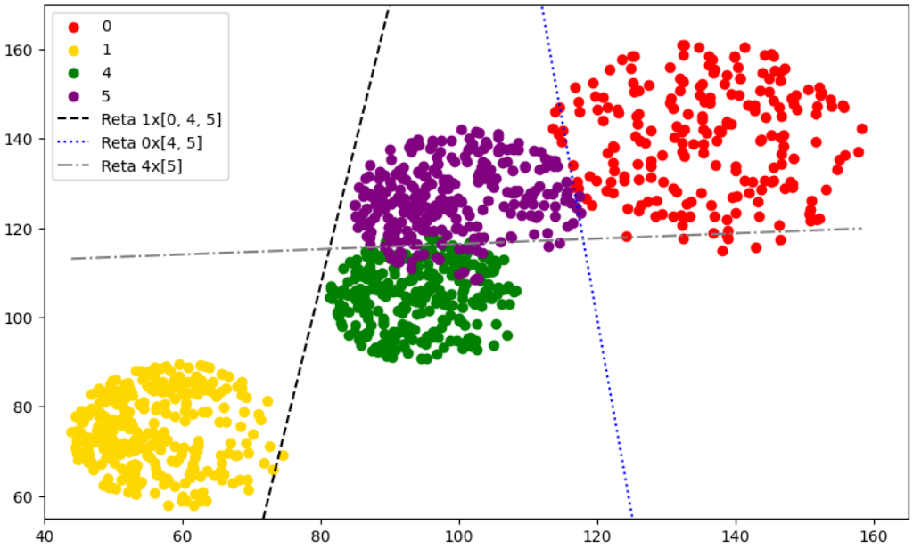
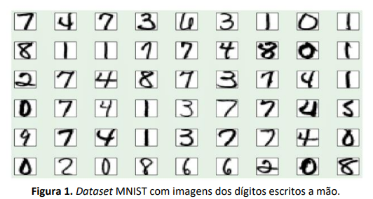
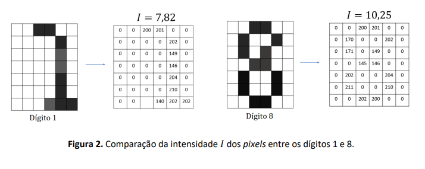
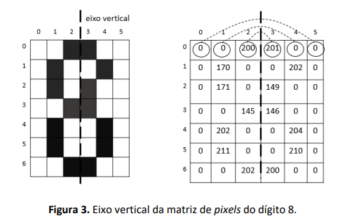
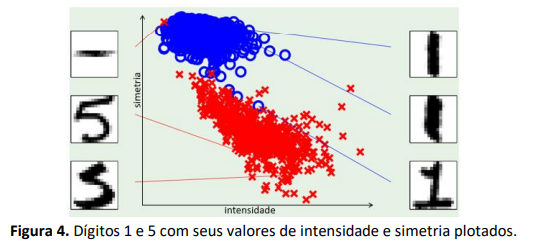
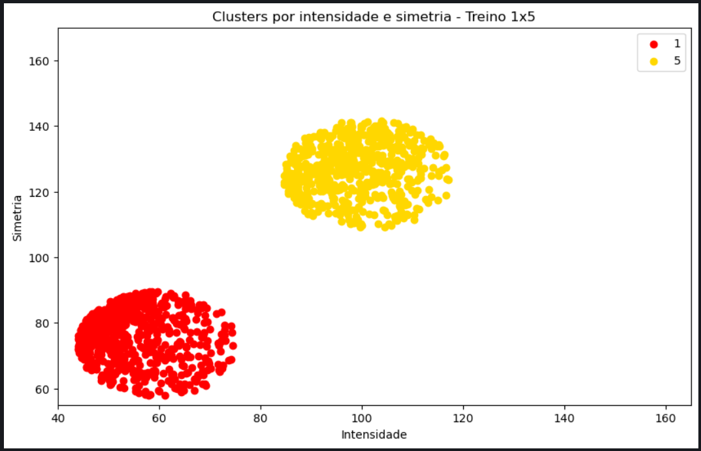
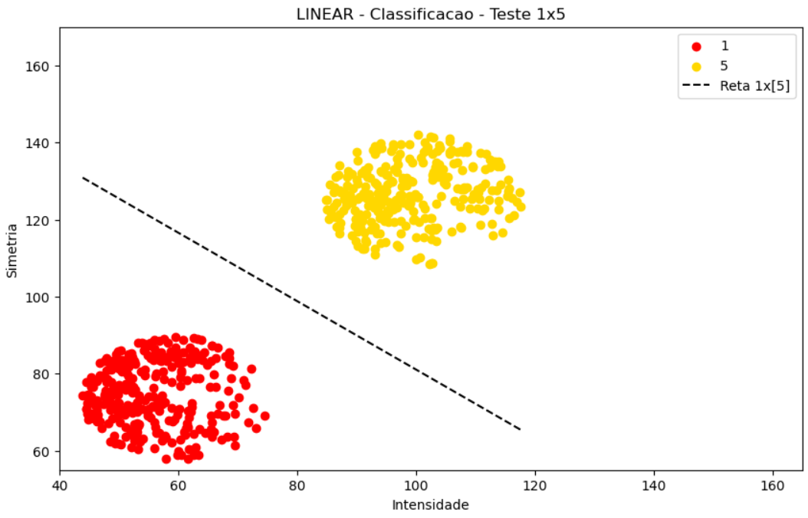
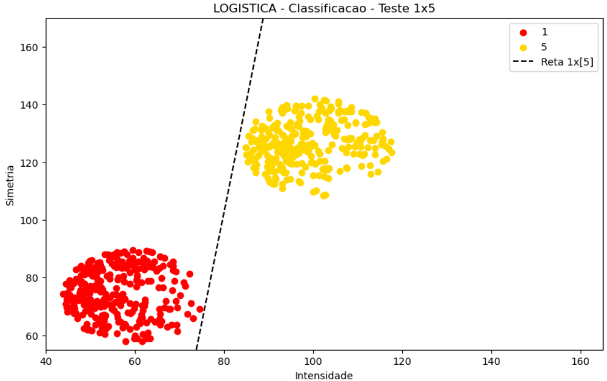
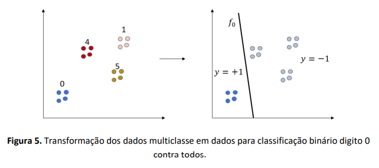
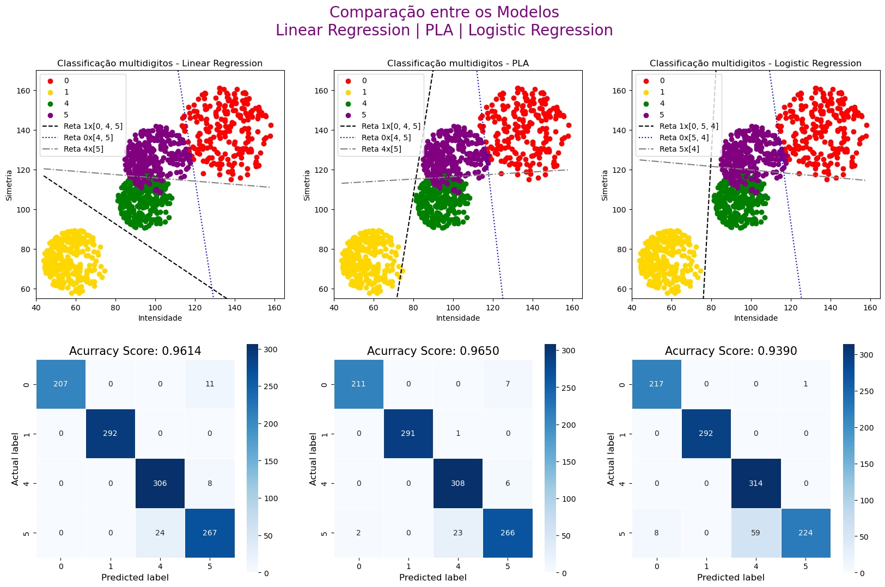

# Classificação de Digitos com Modelos Lineares 



## Algoritmos e estratégias de classificação utilizadas
- Regressão Linear;
- Regressão Logistica;
- Perceptron 2D;
- Um contra todos.

## Dataset
- É uma adaptação do clássico MNIST Dataset, no qual cada classe é linearmente separável 2 a 2.
<br></br>


## Pré-processamento de Features
- Foi aplicada uma redução de dimensionalidade nos registros do dataset;
- Os 782 pixels foram transformados em 2 features: intensidade e simetria.
<br></br>



## Classifcando o digito 1 e 5

- O primeiro teste dos modelos foi classificar os registros de label 1 e 5


---
- Dados de treino utilizados:


### Reta da _Regressão Linear_

### Reta do _PLA_

### Reta da _Regressão Logística_


## Resultado final

- Para efetuar a classificação de todos os digitos (4 labels no total), foi utilizada a estratégia de classificação **"Um contra todos"**.


- E o algoritmo seguido foi o seguinte: 
```
para os dígitos 𝑖 ∈ [0,1,4]
    se 𝑓𝑖(𝑥) = +1
        classifique como dígito i
    senão
        se i == 4
            classifique como dígito 5
```
- Os resultados obtidos são os que se seguem para o uso de cada modelo:


---

